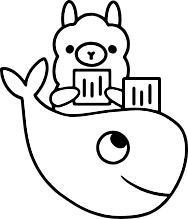

# Ollama
Yapay zeka modellerinin yerel ortamda çalıştırılmasına yarayan özgür yazılım.
<br>


<br>

Ollama, yerel olarak çalışan yapay zeka modellerini kolayca indirip çalıştırmanı sağlayan bir araçtır. Büyük dil modellerini (LLM - Large Language Models) ve diğer AI modellerini bilgisayarında çalıştırmana olanak tanır. Özellikle, geliştiricilerin kendi cihazlarında AI tabanlı uygulamalar geliştirmesini ve test etmesini kolaylaştırır.

## OLLAMA'nın Temel Özellikleri

**Yerel Çalışma:** Modelleri kendi bilgisayarında çalıştırabilirsin böylece bulut servislerine bağımlı kalmazsınız.

**Kolay Kurulum:** Terminal üzerinden basit komutlarla modelleri yükleyebilir ve çalıştırabilirsin.

**Optimize Edilmiş Performans:** GPU ve CPU destekleri sayesinde donanımına uygun şekilde optimize edilir.

**Geliştirici Dostu:** API desteği sayesinde Python veya diğer dillerle entegre edilebilir.

## Nasıl Kullanılır?

Kurulum için terminalde komutlar aşağıdaki gibidir:

```
curl -fsSL https://ollama.com/install.sh | sh
```
 Çalıştılaracak model için:

```
ollama run mistral
```
Mistral, popüler ve güçlü açık kaynaklı bir dil modelidir. Ollama, farklı modelleri çalıştırmak için bir API ve CLI (komut satırı arayüzü) sunar. 

Performans ve Verimlilik açısından Mistral 7B, düşük kaynak tüketimiyle güçlü sonuçlar verebilen bir modeldir.

Ollama ile Entegre Çalışması ile Ollama, Mistral gibi açık kaynaklı modelleri doğrudan destekler bu yüzden de kullanımı yaygındır.

#### Desteklediği diğer modeller
Llama 2, Gemma gibi büyük dil modelleri
Code Llama gibi kodlama destekli modeller
Stable Diffusion gibi görsel üretim modelleri

### OLLAMA'nın Mimarisi ve Çalışma Prensibi

Ollama, yerel yapay zeka modellerini optimize eden bir runtime (çalışma zamanı) sunar. Temel olarak şu bileşenlerden oluşur:

**CLI (Command Line Interface)Terminal** üzerinden çalıştırabileceğin arayüz.

**Ollama Daemon:** Modelleri yöneten ve çalıştıran arka plan servisi.

**Modeller (LLM):** Önceden eğitilmiş veya özel olarak eğitilmiş büyük dil modelleri .

Ollama, **GGUF (GPTQ, GGML)** formatındaki modellere odaklanır, yani düşük RAM tüketimi ile CPU/GPU üzerinde optimize çalışabilir.

<br>


<br>